# PostureApp

A webcam-based posture detection application built in Python using OpenCV, MediaPipe and Tkinter

## Features
- Live webcam posture monitoring
- Manual calibration using the user’s upright sitting position
- Detection of:
  - good posture
  - forward posture
  - left lean
  - right lean
- Audio alert on bad posture
- Uploaded video analysis
- Session logging and stats view
- Automated pytest tests
- GitHub Actions workflow for automated test runs

## Project Structure
- `app/` - main application code
- `tests/` - automated pytest test files
- `docs/images/` - screenshots used in the documentation
- `.github/workflows/` - GitHub Actions workflow for automated testing

## Requirements
Install the required packages:

```bash
pip install -r requirements.txt
```

## How To Run
Run the application from the project folder:
python app/postureDetectionApp.py

## Testing
This project includes automated pytest unit tests for key helper modules.

Test files:
- `tests/test_core_posture.py`
- `tests/test_session_logger.py`
- `tests/test_settings_store.py`

To run the tests:

```bash
python -m pytest tests -v
```
The project also includes a GitHub Actions workflow to run the tests automatically on pushes and pull requests.

## Technologies used
- Python
- OpenCV
- MediaPipe
- Tkinter
- Pillow
- Matplotlib
- Pytest
- GitHub Actions

## Screenshots

### Good posture
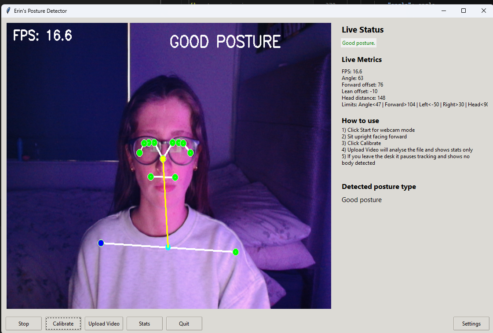

### Checking posture
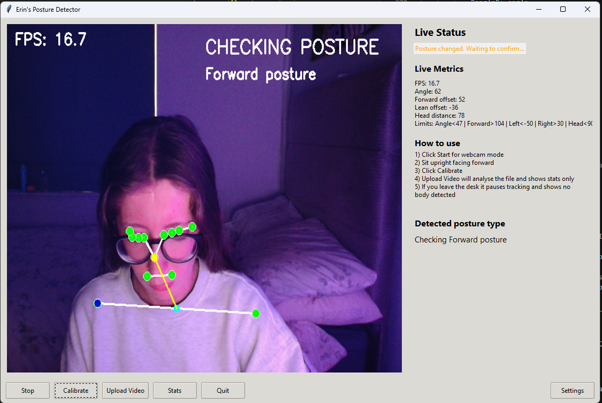

### Bad posture forward
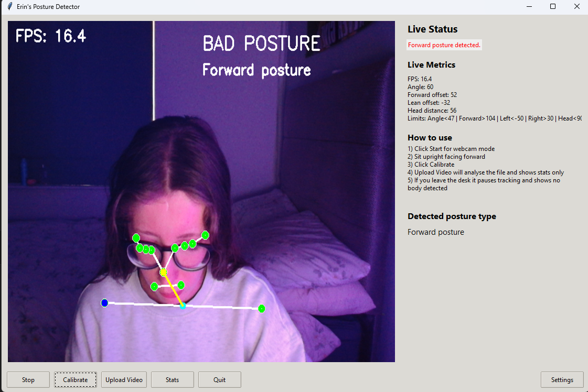

### Bad posture left
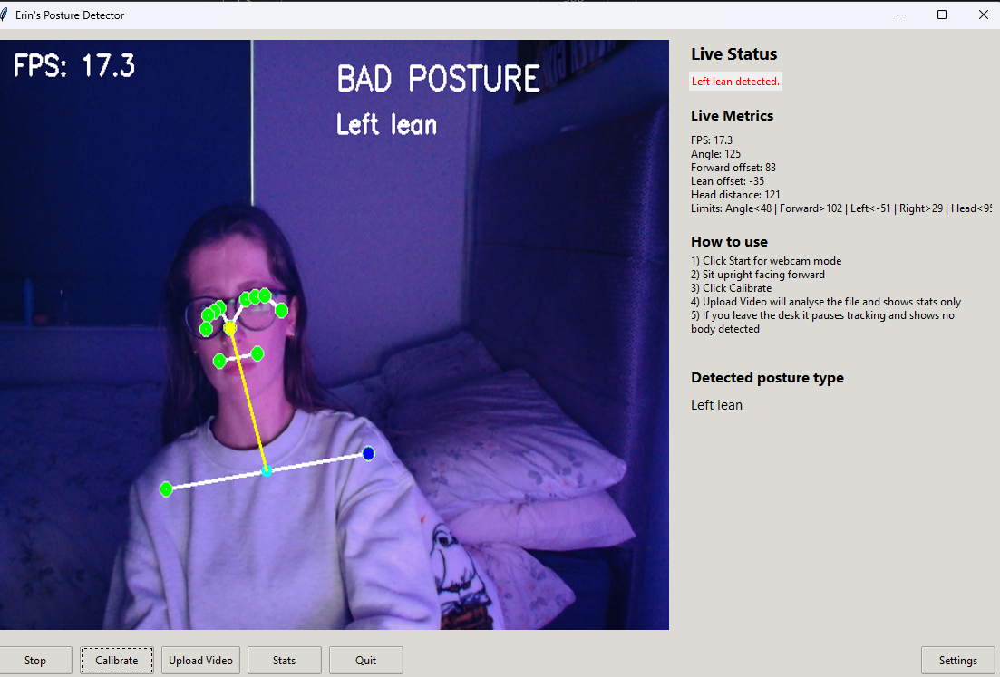

### Bad posture right
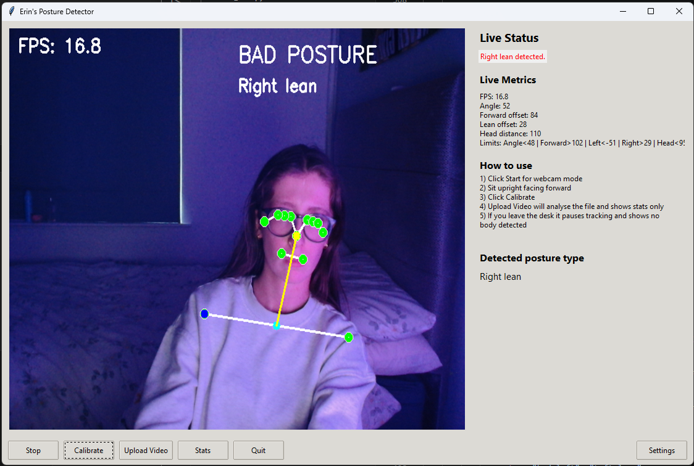

### Statistics view
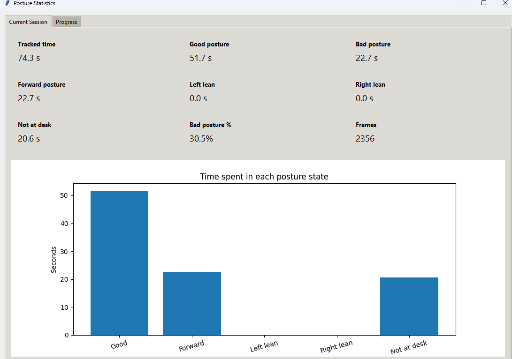

### Progress graph
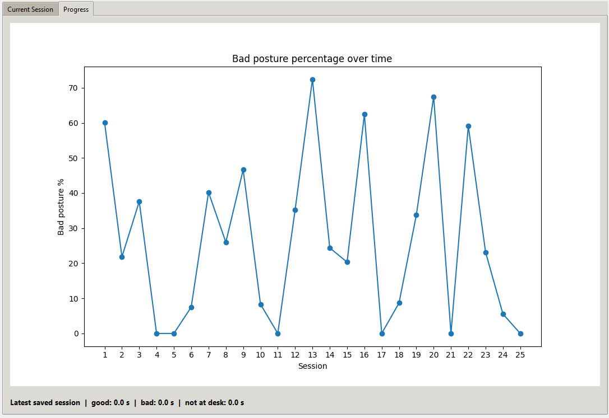

### Upload video analysis
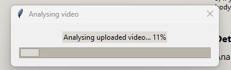

### Audio settings
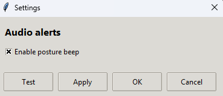

### No body detected
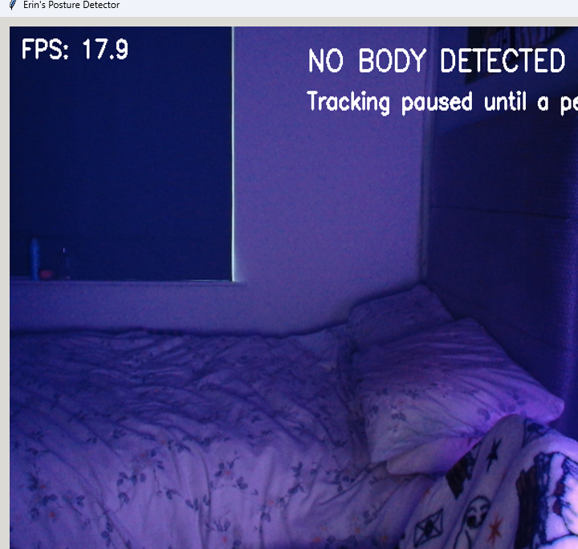

### Test run example
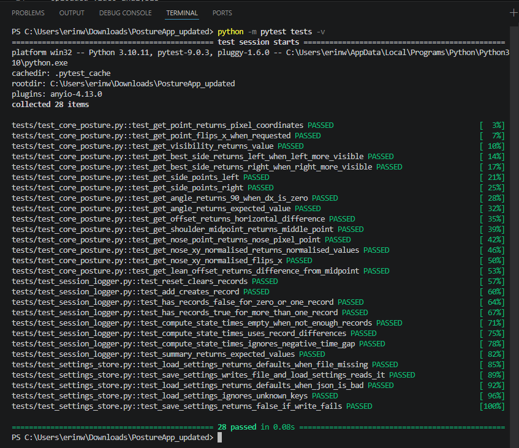


## Future Improvements
- add more automated tests
- improve the visual design of the interface
- add a progressive reminder system
